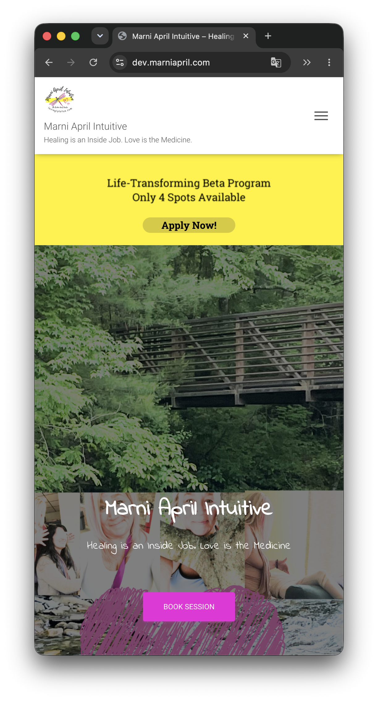

# Hestia Custom Sections

Hestia Custom Sections is a custom WordPress plugin I developed while building a client website using the Hestia theme. The plugin extends the homepage by inserting a responsive promotional banner above the hero section using WordPress hooks, allowing the site's functionality to be expanded without modifying the theme itself.

This repository preserves the project as part of my software engineering portfolio.

---

## Features

- Adds a custom promotional banner above the Hestia hero section
- Uses the `hestia_before_big_title_section_hook`
- Responsive desktop and mobile layouts
- Theme-update safe implementation
- Lightweight single-file plugin

---

## Technologies

- PHP
- WordPress
- HTML
- CSS

---

## Screenshots

These screenshots were taken from the original production website for which this plugin was developed. The website has since been redesigned, but the images have been preserved to demonstrate the plugin in its original context. Client-specific functionality has been replaced with generic placeholders in the source code.

### Desktop

### Mobile

---

## Why I Built It

While developing a client website, I needed functionality that wasn't available in the Hestia theme. Rather than modifying the theme directly—which would make future updates more difficult—I developed a custom plugin that inserts a promotional section using WordPress's hook system.

This approach kept the solution maintainable while allowing the client to continue receiving theme updates.

---

## What I Learned

This project gave me practical experience with:

- WordPress hooks and actions
- Plugin development
- Responsive front-end design
- Separating custom functionality from theme files
- Building solutions for real client requirements

---

## Historical Note

This repository preserves one of my early WordPress development projects. Aside from minor updates for documentation, portability, and the removal of client-specific information, the implementation has intentionally been left close to its original form.

---

## License

This project is licensed under the MIT License.
